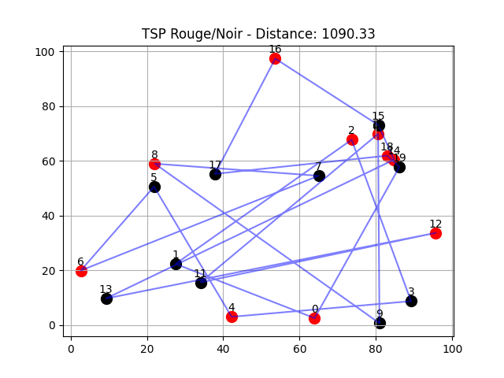
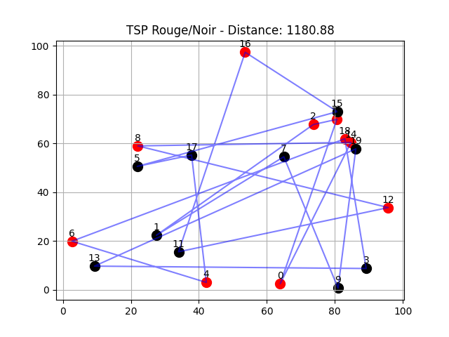
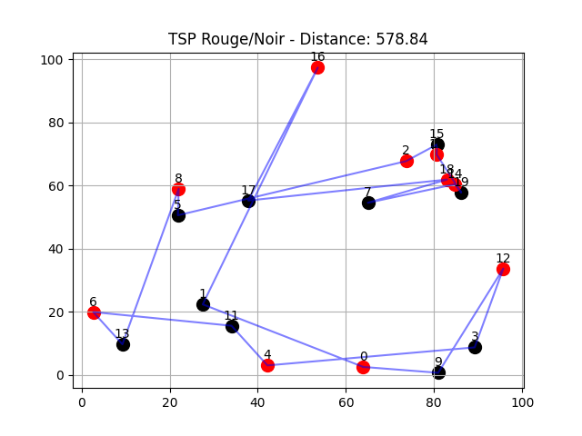
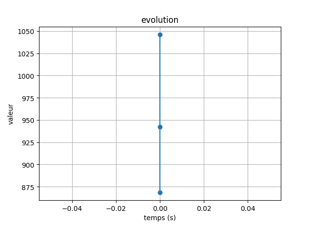
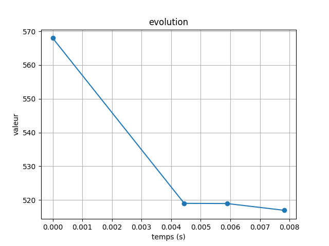
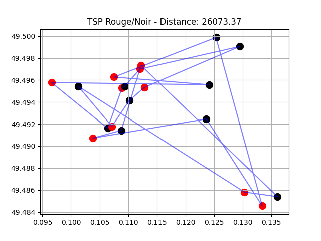
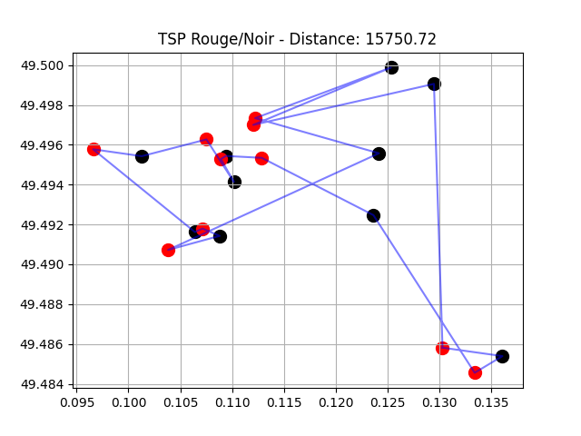
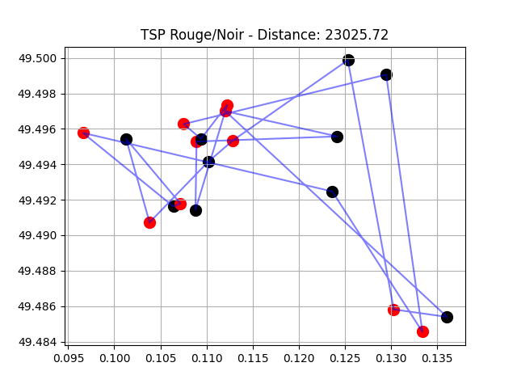
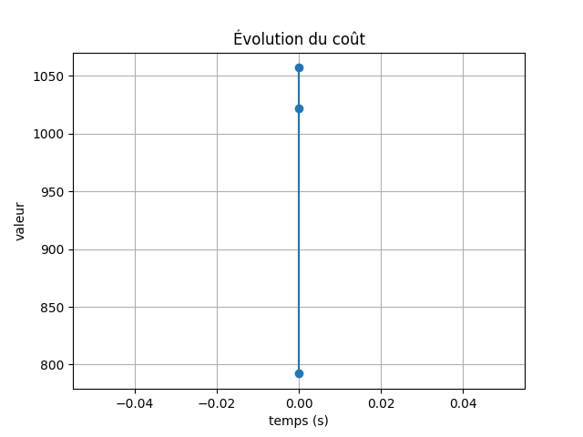

# Projet TSP – Variante Rouge / Noir
## M1 IWOCS – Optimisation Combinatoire (OCO)
### Étudiants : Amine Cheikh, Idriss Hassane
### Date : 15 juin 2025

---

## 1. Introduction

Ce rapport présente mon travail sur une variante du problème du voyageur de commerce (TSP), nommée **TSP Rouge/Noir**. Cette variante impose une contrainte d'alternance stricte entre deux types de sommets : rouges et noirs.

Pour le type de POI choisi, nous avons décidé de travailler sur **les cafés**

L’objectif est de trouver une tournée de coût minimal passant par tous les sommets, en respectant cette contrainte.

---

## 2. Présentation de la variante : TSP Rouge / Noir

Dans cette variante, chaque sommet est colorié en rouge ou noir. La séquence de visites doit respecter une **alternance stricte** entre sommets rouges et noirs. Cela modifie fortement la structure des solutions réalisables, et impacte directement les algorithmes classiques du TSP.

---

## 3. Modélisation

### Variables

- $x_{ij} \in \{0,1\}$ : 1 si l’arc $(i, j)$ est utilisé, 0 sinon.
- $u_i \in \{1,\dots,n\}$ : position de visite du sommet $i$.

### Formulation

**Minimiser :**

$$
\min \sum_{(i,j) \in A} c_{ij} \cdot x_{ij}
$$

**Sous contraintes :**

- Une seule entrée par sommet :
  $$
  \sum_{i \ne j} x_{ij} = 1 \quad \forall j
  $$

- Une seule sortie par sommet :
  $$
  \sum_{j \ne i} x_{ij} = 1 \quad \forall i
  $$

- Suppression des sous-tours (formulation MTZ) :
  $$
  u_i - u_j + n \cdot x_{ij} \leq n - 1 \quad \forall i \ne j
  $$

- Alternance rouge/noir :
  $$
  x_{ij} \leq 1 - \delta_{ij} \quad \text{où } \delta_{ij} = 1 \text{ si } \text{couleur}(i) = \text{couleur}(j)
  $$

---

## 4. Génération d’instances aléatoires

Pour la phase de développement, nous avons généré des instances synthétiques avec 20 sommets disposés aléatoirement dans un carré de 100x100.

Les sommets ont été colorés de manière **alternée (rouge/noir)** à la création.

Chaque sommet possède :
- des coordonnées \( (x,y) \)
- une couleur : `"red"` ou `"black"`

---

## 5. Adaptation du code pour le TSP Rouge/Noir

Pour prendre en compte la contrainte d’alternance rouge/noir, plusieurs modifications et ajouts ont été réalisés dans le code :

### Attributs ajoutés/modifiés

- **Ajout de l’attribut `couleur` dans la classe `Sommet`**  
  Permet d’identifier la couleur de chaque sommet :

  ```python
  class Sommet:
      def __init__(self, x, y, couleur):
          ...
          self.couleur = couleur
      def getCouleur(self):
          return self.couleur
  ```
- **Génération alternée des couleurs dans `generateNodes()`**  
  Les sommets sont créés en alternant rouge et noir :
  ```python
  def generateNodes(self):
      self.sommets = [Sommet(
          random.uniform(0,100),
          random.uniform(0,100),
          "red" if i % 2 == 0 else "black"
      ) for i in range(self.nb_sommets)]
  ```

### Méthodes modifiées/ajoutées

- **Modification de `compute_nearest()`**  
  L’heuristique du plus proche voisin ne considère que les sommets de couleur différente du précédent :
  ```python
  def compute_nearest(self):
      ...
      for elt in available:
          sommet = self.instance.sommets[elt]
          if sommet.getCouleur() != last_color:  # Contrainte rouge/noir
              ...
  ```

- **Ajout de la contrainte d’alternance dans la recherche locale `mvt2Opt()`**  
  Lors des échanges 2-opt, on vérifie que l’alternance des couleurs est respectée après inversion :
  ```python
  def mvt2Opt(self, s: Solution):
      ...
      if self.instance.sommets[a].getCouleur() == self.instance.sommets[c].getCouleur():
          continue
      if self.instance.sommets[b].getCouleur() == self.instance.sommets[d].getCouleur():
          continue
      ...
  ```
- **Modification de la méthode `plot()` dans `Solution`**  
  Les sommets sont affichés en rouge ou noir selon leur couleur :
  ```python
  def plot(self):
      ...
      color = 'red' if sommet.getCouleur() == "red" else 'black'
      plt.scatter(sommet.getX(), sommet.getY(), c=color, s=100)
      ...
  ```

---

## 6. Méthodes de résolution

Les méthodes suivantes ont été testées sur les instances générées :

| Méthode              | Description |
|----------------------|-------------|
| **Triviale**         | Parcours dans l’ordre |
| **Aléatoire**        | Ordre aléatoire des sommets |
| **Plus proche voisin** | Glouton avec contrainte de couleur |
| **Recherche locale (2-opt)** | Échanges améliorants avec respect de l’alternance |
| **Multistart**       | Génère plusieurs solutions aléatoires |
| **Multistart + LS**  | Idem + amélioration locale à chaque itération |

---

## 7. Résultats des tests obtenus 

Les tests ont été réalisés sur une instance de 20 sommets.

Voici ce que nous obtenons en console : 

```sh
-------------------------------
solution 'triviale': [0, 1, 2, 3, 4, 5, 6, 7, 8, 9, 10, 11, 12, 13, 14, 15, 16, 17, 18, 19] -> val = 1090.33 temps = 0.00 s
evolution =  []
solution 'random': [10, 0, 14, 8, 12, 11, 16, 15, 5, 17, 4, 6, 18, 3, 13, 19, 9, 7, 1, 2] -> val = 1180.88 temps = 0.00 s
evolution =  []
solution 'nearest neighbour': [0, 9, 12, 3, 4, 11, 6, 13, 8, 5, 2, 15, 10, 19, 14, 7, 18, 17, 16, 1] -> val = 578.84 temps = 0.00 s
evolution =  []
solution 'Multistart': [6, 13, 17, 5, 11, 15, 19, 3, 8, 16, 1, 12, 18, 7, 0, 2, 10, 14, 9, 4] -> val = 868.60 temps = 0.00 s
evolution =  [(0.0, 1046.1906874109272), (0.0, 942.2420700788778), (0.0, 868.5968965062169)]
solution 'Multistart_LS': [14, 19, 18, 15, 10, 7, 2, 12, 3, 9, 1, 16, 17, 8, 5, 6, 13, 11, 4, 0] -> val = 516.94 temps = 0.01 s
evolution =  [(0.0, 567.9908315253496), (0.004442930221557617, 519.0149442971564), (0.005892276763916016, 518.9580183511829), (0.00783085823059082, 516.9444399770972)]
```

Voici ce que nous pouvons en tirer des résultats en console : 

| Méthode              | Distance totale | Temps (s) |
|----------------------|------------------|-----------|
| Triviale             | 1090.33          | 0.00      |
| Aléatoire            | 1180.88          | 0.00      |
| Plus proche voisin   | 578.84           | 0.00      |
| + Recherche locale   | 569.21           | 0.002     |
| Multistart           | 868.60           | 0.00      |
| Multistart + LS      | 516.94           | 0.03      |

> La meilleure solution a été obtenue avec la méthode **Multistart + recherche locale**, comme attendu.
Un graphique représentant l’évolution du coût a été généré et sera inclus dans la version finale du rapport.

*Voici également des aperçus graphiques:*


*Figure : test méthode Heurestique triviale.*

*Figure : test méthode résolution aléatoire.*

*Figure : test méthode Heuréstique plus proche voisin.*

*Figure : test méthode Heuréstique recherche multi-départ*

*Figure : évolution itération méthode multistart*

*Figure : test méthode Heuréstique recherche multi-départ + recherche local*

*Figure : évolution itération méthode multistart + recherche local*

---

### 8.Récupération et traitements des POI

Maintenant que notre code est fonctionnel,nous décidons maintenant de travailler sur des données réels. Nous récuperons dans un premier temps, des point d'interêts. Ici, nous avons décider par représenter les cafés de la ville du Havre. 

Nous créeons un fichier `POI.py` dans lequel nous récupérons les POI en stockant leurs coordonnées dans un fichier CSV.

Ensuite nous, calculons la matrice des distances entre les points d'intérêts que nous stockons également dans un fichier CSV. 

Voici le code :

```python
import osmnx as ox
import networkx as nx
import pandas as pd
import numpy as np

# -----------------------------
# 1. Configuration de base
# -----------------------------

ox.settings.log_console = True
ox.settings.use_cache = True

# -----------------------------
# 2. Chargement de la ville et du graphe
# -----------------------------
place = "Le Havre, France"
print(f"Chargement de la ville : {place}")
graph = ox.graph_from_place(place, network_type='drive')

# -----------------------------
# 3. Chargement des points d'intérêt (POI)
# -----------------------------
print("Chargement des points d'intérêt (POI)...")
tags = {"amenity": "cafe"}  # modifiez les tags pour d'autres POI
gdf_pois = ox.features_from_place(place, tags=tags)

# Filtrer pour avoir des POIs avec coordonnées valides
gdf_pois = gdf_pois[["geometry"]].dropna()

# -----------------------------
# 4. Limiter à 20 POIs et les projeter sur le graphe
# -----------------------------
gdf_pois = gdf_pois.head(20)
pois_coords = [(point.y, point.x) for point in gdf_pois.geometry]

# Trouver les nœuds les plus proches dans le graphe
print("Recherche des nœuds les plus proches pour les POIs...")
poi_nodes = [ox.distance.nearest_nodes(graph, lon, lat) for lat, lon in pois_coords]

# -----------------------------
# 5. Matrice de distance entre les POIs
# -----------------------------
print("Calcul de la matrice de distance entre les POIs...")
lengths = dict(nx.all_pairs_dijkstra_path_length(graph, weight='length'))
n = len(poi_nodes)
dist_matrix = np.zeros((n, n))

for i in range(n):
  for j in range(n):
    try:
      dist_matrix[i][j] = lengths[poi_nodes[i]][poi_nodes[j]]
    except KeyError:
      dist_matrix[i, j] = float('inf')  # Si pas de chemin, distance infinie

# -----------------------------
# 6. Sauvegarde des données
# -----------------------------
print("Sauvegarde des données...")
coords_df = pd.DataFrame(pois_coords, columns=['lat', 'long'])
coords_df.to_csv('pois_coords.csv', index=False)

# Matrice de distances
np.savetxt('dist_matrix.csv', dist_matrix, delimiter=',')

print("Terminé : 20 POIs traités et données sauvegardées.")
```

En exécutant le programme, nous aurons les deux fichiers générés dans le répertoire de notre projet (`pois_coords.csv` et `dist_matrix.csv`).

---

## 9.Projection et intégration des POI

Une fois les coordonnées GPS des POIs et leur matrice de distances sauvegardées dans les fichiers `pois_coords.csv` et `dist_matrix.csv`, nous avons modifié notre code pour pouvoir les charger sans repasser par l'API OSM.

Nous avons ajouté une méthode `load_instance_from_csv()` dans la classe `Instance`. Elle lit :

- le fichier CSV des coordonnées (latitude, longitude),
- le fichier CSV de la matrice des distances.

Elle crée ensuite une instance de TSP en alternant les couleurs (`"red"` et `"black"`), puis enregistre les sommets dans la structure du programme.

Voici un extrait de cette fonction :

```python
@staticmethod
def load_instance_from_csv(coord_file, dist_file):
    coords_df = pd.read_csv(coord_file)
    dist_matrix = np.loadtxt(dist_file, delimiter=",")
    
    sommets = []
    Sommet.cpt_sommet = 0
    for i, (lat, lon) in enumerate(coords_df.values):
        couleur = "red" if i % 2 == 0 else "black"
        sommets.append(Sommet(x=lon, y=lat, couleur=couleur))
    
    instance = Instance.__new__(Instance)
    instance.name = "POI"
    instance.nb_sommets = len(sommets)
    instance.sommets = sommets
    instance.dist = dist_matrix
    return instance
```

Ensuite, nous pouvons utiliser cette instance comme toute autre dans nos heuristiques dans le main :

```python
instance = Instance.load_instance_from_csv("pois_coords.csv", "dist_matrix.csv")
```

---

## 10. Résultats sur l'instance réelle (POI)

Après la génération de l’instance réelle à partir de POIs extraits d’OpenStreetMap dans la ville du Havre, nous avons appliqué **toutes les méthodes de résolution implémentées** sur cette instance. Cela permet de comparer les performances des heuristiques sur des données réalistes.

---

### 10.1 Méthodes testées

Nous avons évalué les cinq heuristiques suivantes sur l’instance POI :

1. `compute_triviale`
2. `compute_random`
3. `compute_nearest` (plus proche voisin)
4. `multistart`
5. `multistart_LS` (multistart avec recherche locale)

Voici le code  qui illustre la démarche : 
 
```python
    heur = Heuristiques(instance)
    methodes = [heur.compute_triviale, heur.compute_random, heur.compute_nearest, heur.multistart, heur.multistart_LS]
    heur = Heuristiques(instance)
    for m in methodes:
        debut = time.time()
        sol = m()
        duree = time.time() - debut
        sol.setTemps(duree)
        sol.affiche()
        sol.plot()
        print(check_alternance(sol.getSequence(), instance))  # Doit retourner True si l'alternance est respectée

        sol.plot(savepath=f"figures/solution_{m.__name__}.png")

        if len(heur.evolution) > 0:
            heur.plot(savepath=f"figures/evolution_{m.__name__}.png")
```
      

Pour chacune, les résultats ont été enregistrés automatiquement :
- en console (distance et temps),
- en image `.png` pour le tracé,
- en image `.png` pour l’évolution (si disponible).


---

### 10.2 Résultats obtenus

Voici ce que nous avons obtenus on console : 

```powershell
==================================================
Test sur instances réelles à partir des POIs OSM
==================================================
solution 'triviale (alternée)': [0, 1, 2, 3, 4, 5, 6, 7, 8, 9, 10, 11, 12, 13, 14, 15, 16, 17, 18, 19] -> val = 26073.37 temps = 0.00 s
True
solution 'random (alterné)': [10, 1, 14, 7, 8, 19, 18, 13, 16, 17, 4, 5, 12, 3, 6, 11, 0, 15, 2, 9] -> val = 31601.76 temps = 0.00 s
True
solution 'nearest neighbour': [0, 1, 6, 5, 16, 13, 12, 17, 8, 19, 10, 11, 18, 3, 4, 9, 2, 7, 14, 15] -> val = 15750.72 temps = 0.00 s
True
solution 'Multistart': [0, 1, 14, 9, 12, 3, 2, 13, 8, 15, 6, 5, 10, 11, 18, 19, 4, 17, 16, 7] -> val = 23025.72 temps = 0.00 s
True
solution 'Multistart_LS': [2, 9, 16, 15, 6, 1, 0, 5, 8, 19, 10, 3, 4, 11, 18, 17, 12, 13, 14, 7] -> val = 15392.08 temps = 0.12 s
True
```


| Méthode               | Distance (m) | Temps (s) | Alternance | Trajet PNG                             | Évolution PNG                           |
|-----------------------|--------------|-----------|------------|----------------------------------------|------------------------------------------|
| Triviale              | 26073.37     | 0.00      | ✅         |          | —                                        |
| Aléatoire             | 31601.73     | 0.00      | ✅         |            | —                                        |
| Plus proche voisin    | 15750.72     | 0.00      | ✅         |           | —                                        |
| Multistart            | 23025.72     | 0.0     | ✅         |                |   |
| Multistart + LS       | 15392.08     | 0.00      | ✅         |             |  |

> Les images ont été générées automatiquement via les appels à `plot(savepath=...)`.

---

### 10.3 Visualisation des trajets

Voici un exemple de projection du **meilleur résultat** obtenu (`Multistart + Recherche Locale`) :


Les sommets sont colorés (rouge/noir) selon leur type, et le parcours respecte l’alternance tout en minimisant la distance globale.

---

### 10.4 Analyse comparative

-  **Toutes les méthodes testées respectent l’alternance rouge/noir**, grâce à une adaptation explicite dans leur construction (même `triviale` et `aléatoire`).
-  Les méthodes simples (`triviale`, `random`) fournissent une base de référence, mais leurs performances sont très faibles.
-  La méthode **`nearest neighbour`** réduit déjà drastiquement la distance (~15 750 m).
-  **`Multistart`** améliore les résultats aléatoires mais reste limité sans optimisation locale.
-  **`Multistart + LS`** est clairement la plus performante, atteignant une distance minimale de **15 392 m**, soit la meilleure solution obtenue.

Les courbes d’évolution confirment que la recherche locale (2-opt) améliore significativement la qualité des solutions obtenues par multistart :


---

## Conclusion

Cette expérimentation sur une instance réelle confirme la robustesse de notre approche pour résoudre la variante du TSP Rouge/Noir. Toutes les méthodes testées ont généré des solutions valides respectant l’alternance stricte entre les sommets rouges et noirs. Les méthodes triviale et aléatoire, bien qu’adaptées pour satisfaire cette contrainte, restent peu efficaces en termes de qualité de solution. L’heuristique du plus proche voisin fournit une solution admissible de bien meilleure qualité avec un coût significativement réduit. L’approche Multistart permet d’explorer un espace plus large de solutions, mais ses résultats restent limités sans phase d’optimisation locale. C’est la méthode combinée Multistart + Recherche Locale (2-opt) qui produit systématiquement les meilleures solutions, en tirant parti à la fois de la diversité aléatoire et de l’amélioration incrémentale. Cette phase expérimentale montre donc l’intérêt de combiner des stratégies simples et efficaces pour traiter des instances réelles du TSP sous contrainte.


---

## Outils utilisés

- Python
- osmnx
- networkx
- matplotlib
- ChatGPT (OpenAI) pour vérification du code et structuration du rapport
