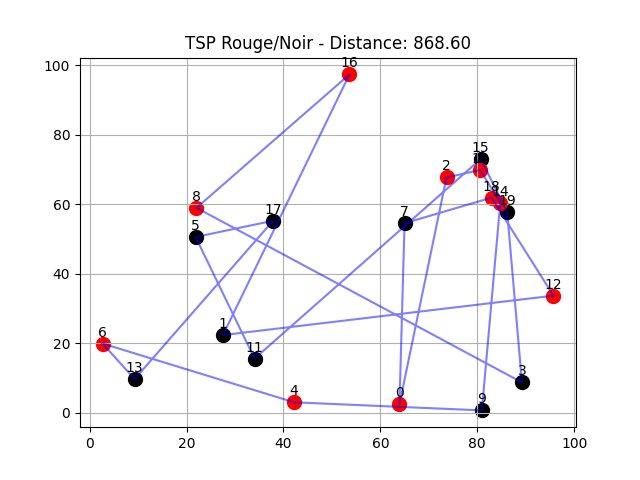
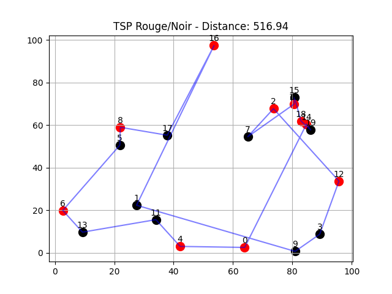

# Projet TSP – Variante Rouge / Noir
## M1 IWOCS – Optimisation Combinatoire (OCO)
### Étudiant : Amine Cheikh 
### Date : 15 juin 2025

---

## 1. Introduction

Ce rapport présente mon travail sur une variante du problème du voyageur de commerce (TSP), nommée **TSP Rouge/Noir**. Cette variante impose une contrainte d'alternance stricte entre deux types de sommets : rouges et noirs.

L’objectif est de trouver une tournée de coût minimal passant par tous les sommets, en respectant cette contrainte.

---

## 2. Présentation de la variante : TSP Rouge / Noir

Dans cette variante, chaque sommet est colorié en rouge ou noir. La séquence de visites doit respecter une **alternance stricte** entre sommets rouges et noirs. Cela modifie fortement la structure des solutions réalisables, et impacte directement les algorithmes classiques du TSP.

---

## 3. Modèle mathématique

### Variables

- \( x_{ij} \in \{0,1\} \) : 1 si l’arc (i, j) est utilisé, 0 sinon.
- \( u_i \in \{1,\dots,n\} \) : position de visite du sommet \( i \).

### Formulation

\[
\min \sum_{(i,j) \in A} c_{ij} \cdot x_{ij}
\]

Sous contraintes :

- Une seule entrée par sommet :
  \[
  \sum_{i \ne j} x_{ij} = 1 \quad \forall j
  \]

- Une seule sortie par sommet :
  \[
  \sum_{j \ne i} x_{ij} = 1 \quad \forall i
  \]

- Suppression des sous-tours (formulation MTZ) :
  \[
  u_i - u_j + n \cdot x_{ij} \leq n - 1 \quad \forall i \ne j
  \]

- Alternance rouge/noir :
  \[
  x_{ij} \leq 1 - \delta_{ij} \quad \text{où } \delta_{ij} = 1 \text{ si couleur}(i) = \text{couleur}(j)
  \]

---

## 4. Génération d’instances aléatoires

Pour la phase de développement, nous avons généré des instances synthétiques avec 20 sommets disposés aléatoirement dans un carré de 100x100.

Les sommets ont été colorés de manière **alternée (rouge/noir)** à la création.

Chaque sommet possède :
- des coordonnées \( (x,y) \)
- une couleur : `"red"` ou `"black"`

---

## 5. Adaptation du code pour le TSP Rouge/Noir

Pour prendre en compte la contrainte d’alternance rouge/noir, plusieurs modifications et ajouts ont été réalisés dans le code :

### Attributs ajoutés/modifiés

- **Ajout de l’attribut `couleur` dans la classe `Sommet`**  
  Permet d’identifier la couleur de chaque sommet :

  ```python
  class Sommet:
      def __init__(self, x, y, couleur):
          ...
          self.couleur = couleur
      def getCouleur(self):
          return self.couleur
  ```
- **Génération alternée des couleurs dans `generateNodes()`**  
  Les sommets sont créés en alternant rouge et noir :
  ```python
  def generateNodes(self):
      self.sommets = [Sommet(
          random.uniform(0,100),
          random.uniform(0,100),
          "red" if i % 2 == 0 else "black"
      ) for i in range(self.nb_sommets)]
  ```

### Méthodes modifiées/ajoutées

- **Modification de `compute_nearest()`**  
  L’heuristique du plus proche voisin ne considère que les sommets de couleur différente du précédent :
  ```python
  def compute_nearest(self):
      ...
      for elt in available:
          sommet = self.instance.sommets[elt]
          if sommet.getCouleur() != last_color:  # Contrainte rouge/noir
              ...
  ```

- **Ajout de la contrainte d’alternance dans la recherche locale `mvt2Opt()`**  
  Lors des échanges 2-opt, on vérifie que l’alternance des couleurs est respectée après inversion :
  ```python
  def mvt2Opt(self, s: Solution):
      ...
      if self.instance.sommets[a].getCouleur() == self.instance.sommets[c].getCouleur():
          continue
      if self.instance.sommets[b].getCouleur() == self.instance.sommets[d].getCouleur():
          continue
      ...
  ```
- **Modification de la méthode `plot()` dans `Solution`**  
  Les sommets sont affichés en rouge ou noir selon leur couleur :
  ```python
  def plot(self):
      ...
      color = 'red' if sommet.getCouleur() == "red" else 'black'
      plt.scatter(sommet.getX(), sommet.getY(), c=color, s=100)
      ...
  ```

---

## 6. Méthodes de résolution

Les méthodes suivantes ont été testées sur les instances générées :

| Méthode              | Description |
|----------------------|-------------|
| **Triviale**         | Parcours dans l’ordre |
| **Aléatoire**        | Ordre aléatoire des sommets |
| **Plus proche voisin** | Glouton avec contrainte de couleur |
| **Recherche locale (2-opt)** | Échanges améliorants avec respect de l’alternance |
| **Multistart**       | Génère plusieurs solutions aléatoires |
| **Multistart + LS**  | Idem + amélioration locale à chaque itération |

---

## 7. Résultats des tests obtenus 

Les tests ont été réalisés sur une instance de 20 sommets.

Voici ce que nous obtenons en console : 

```sh
-------------------------------
solution 'triviale': [0, 1, 2, 3, 4, 5, 6, 7, 8, 9, 10, 11, 12, 13, 14, 15, 16, 17, 18, 19] -> val = 1090.33 temps = 0.00 s
evolution =  []
solution 'random': [10, 0, 14, 8, 12, 11, 16, 15, 5, 17, 4, 6, 18, 3, 13, 19, 9, 7, 1, 2] -> val = 1180.88 temps = 0.00 s
evolution =  []
solution 'nearest neighbour': [0, 9, 12, 3, 4, 11, 6, 13, 8, 5, 2, 15, 10, 19, 14, 7, 18, 17, 16, 1] -> val = 578.84 temps = 0.00 s
evolution =  []
solution 'Multistart': [6, 13, 17, 5, 11, 15, 19, 3, 8, 16, 1, 12, 18, 7, 0, 2, 10, 14, 9, 4] -> val = 868.60 temps = 0.00 s
evolution =  [(0.0, 1046.1906874109272), (0.0, 942.2420700788778), (0.0, 868.5968965062169)]
solution 'Multistart_LS': [14, 19, 18, 15, 10, 7, 2, 12, 3, 9, 1, 16, 17, 8, 5, 6, 13, 11, 4, 0] -> val = 516.94 temps = 0.01 s
evolution =  [(0.0, 567.9908315253496), (0.004442930221557617, 519.0149442971564), (0.005892276763916016, 518.9580183511829), (0.00783085823059082, 516.9444399770972)]
```

Voici ce que nous pouvons en tirer des résultats en console : 

| Méthode              | Distance totale | Temps (s) |
|----------------------|------------------|-----------|
| Triviale             | 1090.33          | 0.00      |
| Aléatoire            | 1180.88          | 0.00      |
| Plus proche voisin   | 578.84           | 0.00      |
| + Recherche locale   | 569.21           | 0.002     |
| Multistart           | 868.60           | 0.00      |
| Multistart + LS      | 516.94           | 0.03      |

> La meilleure solution a été obtenue avec la méthode **Multistart + recherche locale**, comme attendu.
Un graphique représentant l’évolution du coût a été généré et sera inclus dans la version finale du rapport.

*Voici également des aperçus graphiques:*


*Figure : test méthode Heurestique triviale.*

*Figure : test méthode résolution aléatoire.*

*Figure : test méthode Heuréstique plus proche voisin.*

*Figure : test méthode Heuréstique recherche multi-départ*

*Figure : évolution itération méthode multistart*

*Figure : test méthode Heuréstique recherche multi-départ + recherche local*

*Figure : évolution itération méthode multistart + recherche local*

---

## 8. Outils utilisés

- Python 3.10
- osmnx
- networkx
- matplotlib
- ChatGPT (OpenAI) pour vérification du code et structuration du rapport

---

## 9. Annexes

- `TSP.py` (code modifié)
- `instances/*.csv` (à compléter)
- `graphes/*.png` (visualisations)
- `osm_pois_lehavre.py`